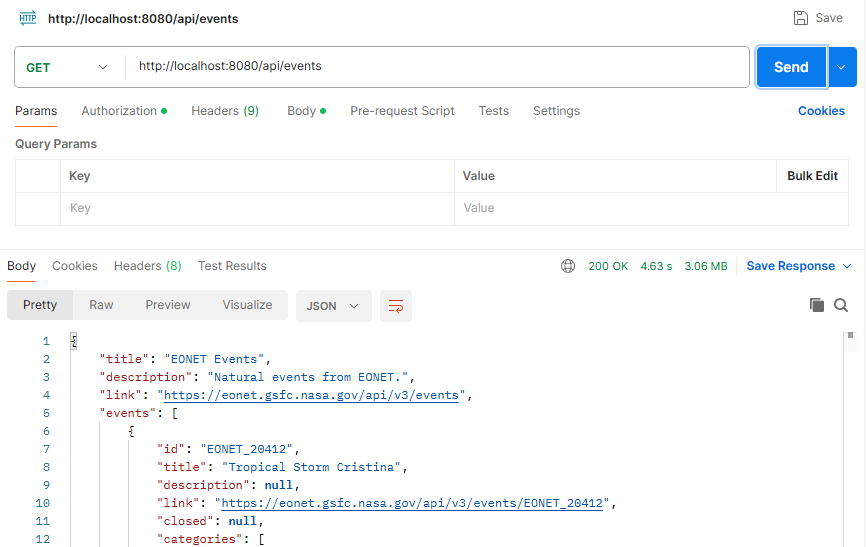
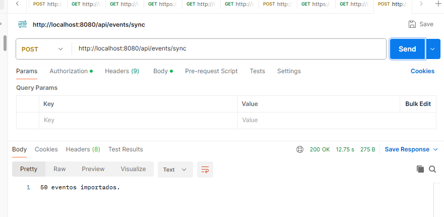
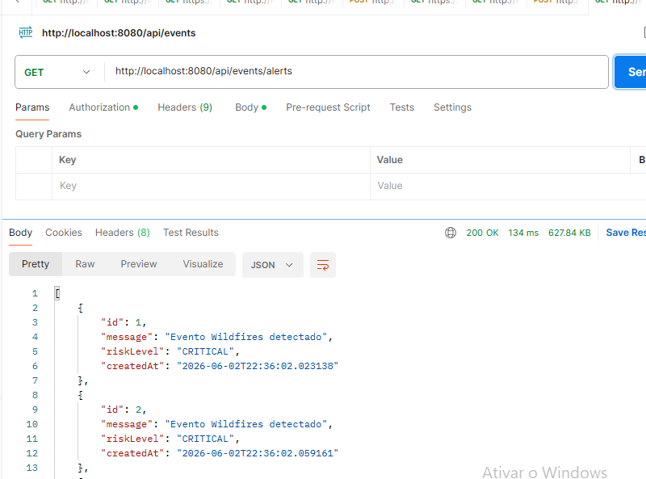

# Horizonte de Risco 🌎🚨

## Global Solution - FIAP

## Integrantes

* Nome 1 - RM XXXXX
* Nome 2 - RM XXXXX
* Nome 3 - RM XXXXX

---

## 📖 Sobre o Projeto

O **Horizonte de Risco** é uma solução de monitoramento e análise de desastres naturais baseada em dados espaciais fornecidos pela NASA através da API EONET (Earth Observatory Natural Event Tracker).

A aplicação consome eventos naturais em tempo real, como incêndios florestais, tempestades severas, vulcões, secas e outros fenômenos ambientais, realizando a classificação automática do nível de risco e gerando alertas para acompanhamento e tomada de decisão.

O objetivo é transformar dados espaciais em informações úteis para prevenção, monitoramento e resposta a eventos que podem causar impactos ambientais, econômicos e sociais.

---

## 🎯 Motivação do Projeto

Com o aumento da frequência de eventos climáticos extremos e desastres naturais em diversas regiões do planeta, torna-se cada vez mais importante utilizar tecnologias espaciais para monitoramento e prevenção.

A NASA disponibiliza uma grande quantidade de dados públicos sobre eventos naturais através da plataforma EONET. Entretanto, esses dados normalmente são consumidos por especialistas.

O Horizonte de Risco foi desenvolvido para atuar como uma camada intermediária de inteligência, organizando os eventos recebidos, classificando riscos e gerando alertas de forma automatizada.

Dessa forma, a solução demonstra como tecnologias espaciais podem ser utilizadas para gerar valor e auxiliar a sociedade na mitigação de riscos e no planejamento de ações preventivas.

---

## 🚀 Objetivo da Solução

Desenvolver uma API REST capaz de:

* Consumir eventos naturais da NASA EONET;
* Classificar automaticamente o risco dos eventos;
* Gerar alertas para monitoramento;
* Armazenar informações em banco de dados;
* Disponibilizar os dados através de endpoints REST.

---

## 🛰 Integração com Tecnologias Espaciais

A solução utiliza a API oficial da NASA EONET:

```text
https://eonet.gsfc.nasa.gov/api/v3/events
```

A API fornece eventos naturais monitorados por satélites e sistemas de observação terrestre.

Exemplos:

* Wildfires (Incêndios Florestais)
* Volcanoes (Vulcões)
* Severe Storms (Tempestades Severas)
* Sea and Lake Ice
* Droughts (Secas)

---

## 🏗 Arquitetura da Solução

```text
NASA EONET API
        │
        ▼
   EonetClient
        │
        ▼
   SyncService
        │
        ▼
RiskClassificationService
        │
        ▼
      MySQL
        │
        ▼
 AlertRepository
        │
        ▼
 REST Endpoints
```

---

## 🛠 Tecnologias Utilizadas

* Java 25
* Spring Boot
* Maven
* MySQL
* Spring Data JPA
* REST API
* NASA EONET API

---

## ⚙ Regras de Negócio

A aplicação classifica automaticamente o risco dos eventos.

Exemplo:

| Categoria NASA | Risco |
|---------------|--------|
| Wildfires | ALTO |
| Volcanoes | ALTO |
| Severe Storms | MÉDIO |
| Sea and Lake Ice | BAIXO |
| Drought | MÉDIO |

---

## 🔗 Endpoints Disponíveis

### Buscar eventos da NASA

#### Request

```http
GET /api/events
```

#### Exemplo

```http
GET http://localhost:8080/api/events
```

---

### Sincronizar eventos

Consulta a NASA e importa os eventos para o sistema.

#### Request

```http
POST /api/events/sync
```

#### Exemplo

```http
POST http://localhost:8080/api/events/sync
```

#### Response

```text
50 eventos importados.
```

---

### Listar alertas

#### Request

```http
GET /api/events/alerts
```

#### Exemplo

```http
GET http://localhost:8080/api/events/alerts
```

#### Response

```json
[
  {
    "id": 1,
    "message": "Evento Wildfires detectado",
    "riskLevel": "ALTO"
  }
]
```

---

## 🧪 Evidências de Execução

### Teste 1 - Consulta de Eventos NASA

#### Requisição

```http
GET http://localhost:8080/api/events
```

#### Resultado Esperado

Retorno dos eventos naturais disponibilizados pela NASA EONET.



---

### Teste 2 - Sincronização de Eventos

#### Requisição

```http
POST http://localhost:8080/api/events/sync
```

#### Resultado Esperado

Importação dos eventos e geração dos alertas.



---

### Teste 3 - Consulta de Alertas

#### Requisição

```http
GET http://localhost:8080/api/events/alerts
```

#### Resultado Esperado

Listagem dos alertas gerados.



---

## ✅ Requisitos da Disciplina Atendidos

* Programação Orientada a Objetos
* Classes Públicas e Privadas
* Injeção de Dependência
* Consumo de API Externa
* Web Services REST
* DTOs
* Tratamento de Dados
* Banco de Dados MySQL
* Spring Data JPA
* Estrutura em Camadas
* Integração com Tecnologia Espacial
* Evidências de Execução

---

## ⚙ Observação para Execução

O projeto pode ser executado de duas formas:

### Opção 1 - Banco de Dados Local

Configure o arquivo `application.properties` com as credenciais do seu MySQL local.

```properties
spring.datasource.url=jdbc:mysql://localhost:3306/horizontederisco
spring.datasource.username=SEU_USUARIO
spring.datasource.password=SUA_SENHA
```

### Opção 2 - API Online

Caso não queira configurar banco de dados local, é possível utilizar diretamente a API já publicada no Render.

#### Eventos

```http
GET https://horizontederisco.onrender.com/api/events
```

#### Alertas

```http
GET https://horizontederisco.onrender.com/api/events/alerts
```

> A API está hospedada no plano gratuito do Render e pode levar alguns minutos para responder após períodos de inatividade.

## 🌍 Conclusão

O Horizonte de Risco demonstra como dados espaciais disponibilizados pela NASA podem ser utilizados para apoiar o monitoramento de desastres naturais e a geração de alertas automatizados. A solução integra tecnologias modernas de desenvolvimento de software com informações provenientes de observação da Terra, transformando dados brutos em informações úteis para apoio à tomada de decisão e prevenção de riscos.